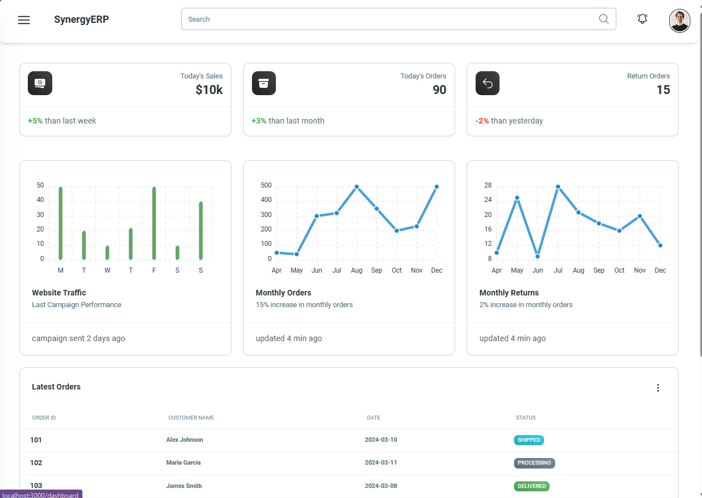
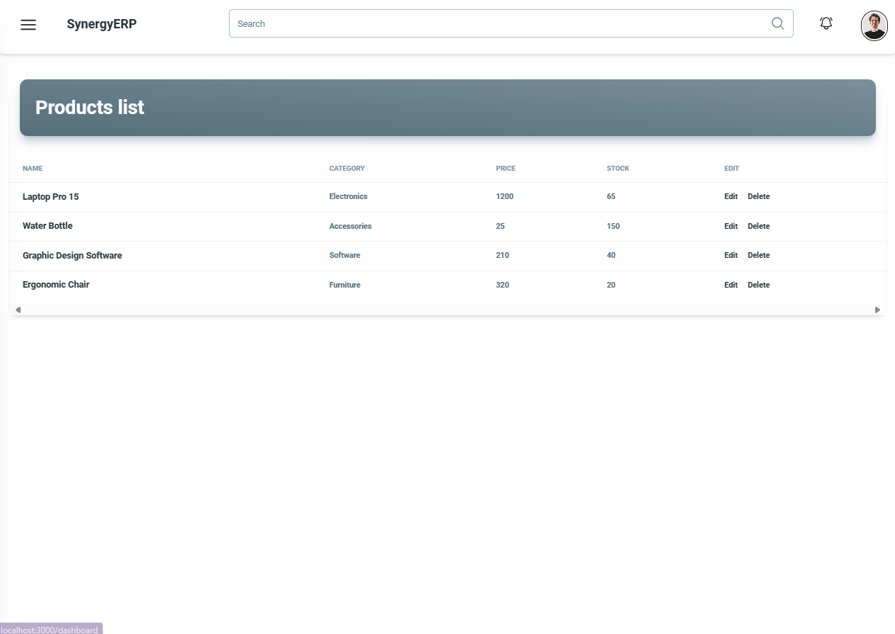
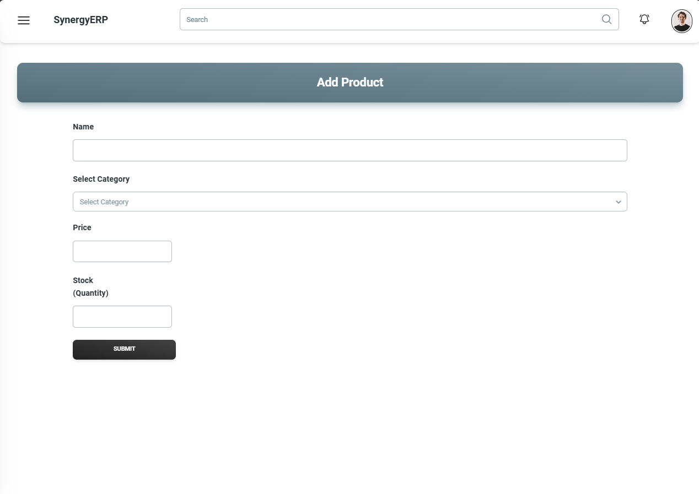
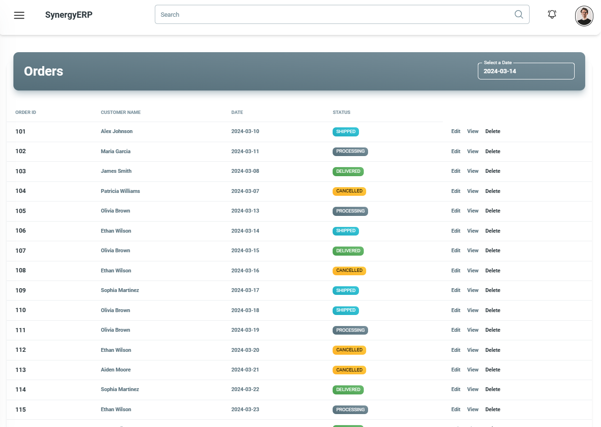
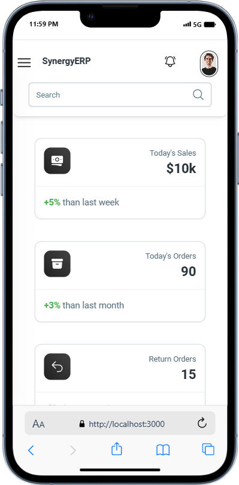
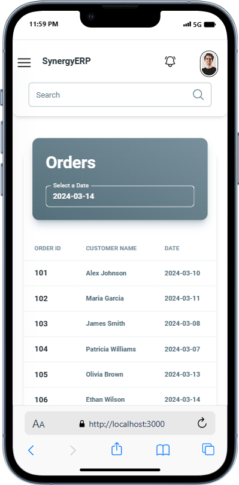
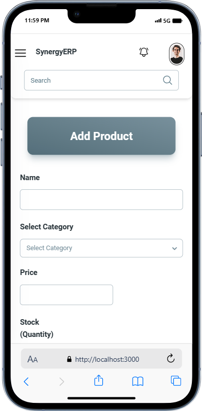
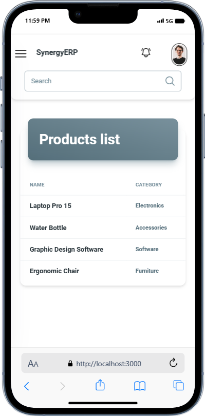

# Simplified ERP System with React

The Simplified ERP System with React is a web application designed to streamline and manage essential business operations efficiently. This project aims to provide a user-friendly interface for handling key aspects such as product management, order tracking, and calendar-based order visualization.

Live Demo: [https://definesentinal.github.io/synergy-erp](https://definesentinal.github.io/synergy-erp)

## Features

- **Dashboard**: Get an overview of the system's features and key metrics at a glance, with visual representations using charts (e.g., mountain charts).
- **Product Management**: Seamlessly manage your product listings, including adding, editing, and deleting products. List view with product details is available.
- **Order Management**: View and handle customer orders, including updating order status, deletion, and filtering by dates. Orders are color-coded based on their status for better visibility.
- **Order Calendar View**: Visualize orders on a calendar based on their expected delivery dates.

## Technologies Used

- React.js
- Redux (with Redux Toolkit)
- React Router
- Local Storage (with LocalForage for data persistence)
- Responsive Design (for desktop and mobile devices)
- Material Tailwind UI components
- Other libraries: `@heroicons/react`, `react-apexcharts`, `react-calendar`, `react-hot-toast`, `match-sorter`, `nanoid`, `sort-by`

## Installation

To run the Simplified ERP System with React locally, follow these steps:

1. Clone the repository: `git clone https://github.com/defineSenTinaL/synergy-erp`
2. Navigate to the project directory: `cd synergy-rp`
3. Install dependencies: `npm install`
4. Start the development server: `npm run dev`
5. Open your browser and visit: `http://localhost:3000`
6. To build project for production: `npm run build`

## Usage

Upon launching the application, you'll be greeted by the Dashboard, which provides an overview of the system's features and key metrics at a glance. From there, you can access the following sections:

### Product Management

In the Product Management section, you can:

- View a list of existing products with details such as name, category, price, and stock quantity.
- Add new products to the system.
- Edit the details of existing products.
- Delete products from the system.

### Order Management

The Order Management section allows you to:

- View a list of customer orders, including order ID, customer name, order date, and status.
- Filter orders by date range.
- View detailed information about a specific order.
- Update the status of an order.
- Delete an order from the system.

### Order Calendar View

The Order Calendar View provides a visual representation of orders based on their expected delivery dates. You can:

- Navigate through the calendar to view orders for different dates.
- Click on a specific date to see all orders scheduled for delivery on that day.

## Future Enhancements

Here are some potential future enhancements for the Simplified ERP System with React:

- Implement authentication and user roles for increased security and access control.
- Integrate with a backend server and database for persistent data storage.
- Enhance the Order Management section with advanced filtering, sorting, and search capabilities.
- Implement real-time updates and notifications for order status changes.
- Expand the system to include additional features such as inventory management, reporting, and analytics.

## Picture Gallery

Here are some screenshots showcasing the Simplified ERP System with React:

 | 

## License

This project is licensed under the [MIT License](LICENSE).